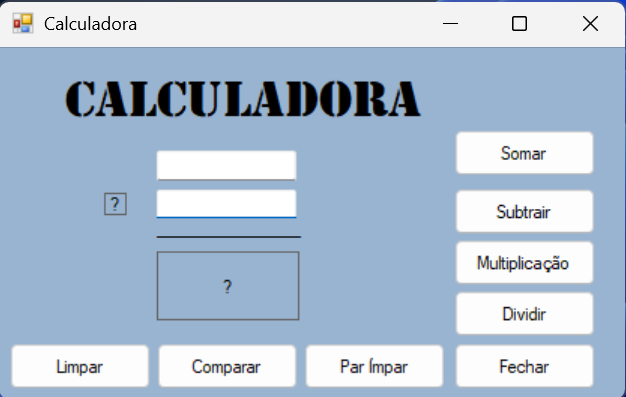

# Calculadora  
Versão Atual : 2.1
## Índice 
- [Introdução](#Introdução)
  - [Calculadora com Botões](#Calculadora-com-Botões)
    - [Layout](#Layout)
    - [Funções](#Funções) 
      - [Limpar](#Limpar-(Shift-+-L)) 
      - [Comparar](#Comparar-(Shift-+-C))
      - [Par Ímpar (Shift + P)](#Par-Ímpar-(Shift-+-P))
      - [Fechar (Shift + F)](#Fechar-(Shift-+-F))
      - [Funções básicas de calculadora](#Funções-básicas-de-calculadora)
        - [Somar (Shift + S)](#Somar-(Shift-+-S))
        - [Subtrair (Shift + T)](#Subtrair-(Shift-+-T))
        - [Multiplicar (Shift + M)](#Multiplicar-(Shift-+-M))
        - [Dividir (Shift + D)](#Dividir-(Shift-+-D))
    - [Tratamento de Erros](#Tratamento-de-Erros)
      - [Letras em vez de Números](#Letras-em-vez-de-Números)
      - [Divisão por zero](#Divisão-por-zero)
- [Versões](#Versões)
  - [1.2](#12)
  - [1.1](#11)
## Introdução   
Essa é uma calculadora básica com algumas funções a mais. Para utilizá-la, digite os números na textbox e aperte em algum botão para fazer sua respectiva função.
#### Layout 

#### Funções  
##### Limpar (Shift + L)  
Limpa os números das textbox, o algarismo e o resultado.  
##### Comparar (Shift + C)  
Compara os números e devolve como resultado qual é maior da seguinte forma :   
| X é o maior |
| --- |   
  
(sendo X o número)  
Também define o algarismo como "<" ou ">" dependendo de qual é maior  
##### Par Ímpar (Shift + P) 
Devolve como resultado se cada número é par ou ímpar da seguinte forma :  
| N1 : par   N2 : impar|  
| --- | 
    
(n(x) sendo cada número e par ou ímpar sendo o correspondente ao número)  
##### Fechar (Shift + F)  
Fecha o aplicativo  
##### Funções básicas de calculadora  
As funções abaixo são as operações básicas. Para os exemplos suponha que os valores são 10 e 4.  
###### Somar (Shift + S )  
Soma os números e define o algarismo como : +  
| Resultado do exemplo |  
| --- |   
| 14 |  

##### Subtrair (Shift + T )  
Sutrai os números e define o algarismo como : -  
| Resultado do exemplo |  
| --- |   
| 6 |  
##### Multiplicar (Shift + M )  
Multiplica os números e define o algarismo como : *  
| Resultado de Exemplo |  
| --- |   
| 40 |  
##### Dividir (Shift + D )  
Divide os números e define o algarismo como : /  
| Resultado de Exemplo |  
| --- |   
| 2,5 |  
#### Tratamento de Erros   
Atualmente dois tipos de erros são tratados :  
##### Letras em vez de Números 
Aparece uma janelinha escrita : Informe apenas números  
##### Divisão por zero  
Caso você tente dividir um número por 0 aparece uma janela escrito : Impossível divisão por zero
## Versões : 
2.1 : Limitação de uma instância por formulário e adicionada Calculadora com Radio Buttons
2.0 : Implementação do Mdi_Menu para gerenciar as futuras ferramentas diversas
1.2 : Calculadora com todas as funções básicas, além de comparar e ver se é par.  
1.1 : Calculadora básica, só com soma, fechar e limpar.  
